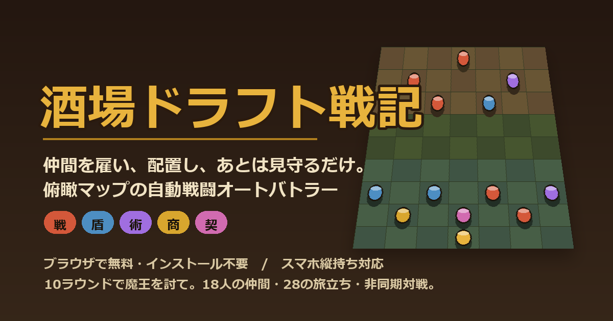

<!-- 画像はリポジトリ内の img/ を相対パスで参照している。
     README を差し替えるときは img/ogp.png も一緒にアップロードすること（無いと画像が割れる）。 -->

<div align="center">



# 🍺 酒場ドラフト戦記

**仲間を雇い、配置し、あとは見守るだけ。**
ブラウザだけで遊べる、俯瞰マップの自動戦闘オートバトラー。

### ▶ [**いますぐ遊ぶ（無料・インストール不要）**](https://frog-glendronach18-plz.github.io/sakaba-beta-83kf2p/)


</div>

---

## ⚔️ どんなゲーム？

酒場に流れ着いた者たちを雇い、盤面に並べ、魔王軍に挑む **オートバトラー**（自動戦闘ゲーム）です。

戦闘中、あなたは操作しません。**勝負は「戦闘が始まる前」に決まっています。**
誰を雇うか、どこに置くか、いつ金を使うか——その選択だけで戦局が変わります。

```
募兵 ──▶ 配置 ──▶ 自動戦闘 ──▶ 収入 ──▶ 次のラウンドへ
 ↑                                            │
 └──────────── 全10ラウンド ─────────────────┘
```

10ラウンド勝ち抜いて **魔王を討伐** すれば勝利。体力が尽きれば旅は終わりです。

**1プレイ約10分。** 通勤中でも、寝る前の一杯のあいだにでも。

---

## 🎮 3ステップでわかる遊び方

| | |
|---|---|
| **① 雇う** | 酒場に並ぶ4人から、ゴールドを払って仲間を雇います。同じ仲間を2人集めると **合体して★アップ**（最大★4）。 |
| **② 置く** | 自陣（盤面の下4行）に配置。前衛に壁、後方に射手——**置き方がそのまま戦術**になります。 |
| **③ 見守る** | ⚔️戦闘開始を押したら、あとは自動。仲間たちが勝手に動き、殴り、倒れます。 |

戦闘前には **攻撃予測ライン** が表示されるので、「誰が誰を狙うか」を見ながら配置を詰められます。

---

## ✨ このゲームの特徴

### 🔗 5つのシナジー
同じ系統の仲間を **2体 / 4体 / 6体** そろえると、部隊全体が強化されます。

| | 系統 | 効果 |
|:--:|:--|:--|
| 🔴 | **戦** | 味方全員の攻撃力アップ |
| 🔵 | **盾** | 味方全員の体力アップ |
| 🟣 | **術** | 開幕に敵前列へ一斉魔法 |
| 🟡 | **商** | 毎ラウンドの収入アップ |
| 🌸 | **契** | 契約の精霊が加勢（部隊枠を使わない） |

さらに、特別な加護を授かった旅では **8体シナジー** が解放されることも。

### 🍀 28種類の「旅立ちイベント」
ゲーム開始時、3つの選択肢から1つを選びます。これがそのランの方向性を決めます。

> **背水の陣** — 体力1でスタート。ただし精鋭部隊が最初から揃っている
> **ワンマンアーミー** — 将軍以外は出撃できない。売った仲間の力を将軍が継承する
> **移動要塞** — 動かないはずの城壁が歩き出す。倒れても衛兵として蘇る
> **神話魔法** — 大魔術師の魔法が着弾点を燃やし続ける

……など、**プレイ感がまるごと変わる**イベントが28種類。毎回ちがう旅になります。

### 🏮 宴の夜
ラウンド5に到達すると酒場で宴が開かれ、その夜だけ **特定の系統・Tierだけが並ぶ**特別な募兵に。シナジー完成のチャンスです。

### 🗺️ 4つの戦場
3ラウンドごとに地形が変化します。

🌾 **草原** 遮蔽なし・遠射程が伸びる ／ ⛰️ **山岳** 岩山が進路を阻む
❄️ **雪原** 足を取られ移動が鈍る ／ 🔥 **魔界** 魔王の待つ最終決戦地

### 🏟️ 闘技場 — 他プレイヤーの軍団と戦う（非同期対戦）
完走した部隊は **軍団として登録** でき、他のプレイヤーの軍団と戦えます。
相手はあなたが挑んだ時点の記録から再現される「ゴースト軍団」なので、**相手のオンライン状況は関係ありません**。

さらに **挑戦コード** を発行すれば、自分の軍団をSNSやLINEで友達に送りつけて戦わせることも。

### 📱 その他
- **PWA対応** — ホーム画面に追加すればオフラインでも遊べます
- **中断・再開** — 途中でブラウザを閉じても、次に開けば続きから
- **プレイ統計** — よく使う仲間、勝率、イベント別プレイ回数を記録（**端末内のみ・外部送信なし**）
- **BGM & 効果音** — 場面ごとに9曲。音量は設定から調整可

---

## 📸 スクリーンショット

<!-- TODO: 実際のプレイ画面を img/ 配下に置いて差し替える（推奨: 縦長 3枚）
     例) img/shot-shop.png / img/shot-battle.png / img/shot-arena.png -->

| 酒場で募兵 | 自動戦闘 | 闘技場 |
|:--:|:--:|:--:|
| _準備中_ | _準備中_ | _準備中_ |

---

## 📲 スマホにインストールする（PWA）

アプリストア不要。ホーム画面に追加すると全画面で起動し、**オフラインでも遊べます**。

<details>
<summary><b>iPhone / iPad（Safari）</b></summary>

1. Safari で [ゲームページ](https://frog-glendronach18-plz.github.io/sakaba-beta-83kf2p/) を開く
2. 下部の **共有ボタン**（□に↑）をタップ
3. **「ホーム画面に追加」** を選ぶ

</details>

<details>
<summary><b>Android（Chrome）</b></summary>

1. Chrome で [ゲームページ](https://frog-glendronach18-plz.github.io/sakaba-beta-83kf2p/) を開く
2. 右上の **︙メニュー** をタップ
3. **「アプリをインストール」／「ホーム画面に追加」** を選ぶ

</details>

---

## 📖 もっと詳しく

<details>
<summary><b>盤面と戦闘のルール</b></summary>

- 盤面は **横7×縦9マス**。下の4行があなたの陣地です
- 移動・攻撃は **斜めを含む8方向**。斜め隣も「隣接」として扱います
- **狙いの持続**: 一度攻撃した相手は、倒れるか射程外に出るまで狙い続けます
- **引き付け**: 🛡️衛兵・🏰城塞兵は優先的に狙われます。前に置いて壁にしましょう
- **接敵**: 敵と隣接したユニットはその場で交戦し、移動・逃走できません
- **宝箱**: 戦場に最大4個出現。味方が踏むと+1G、敵に踏まれると消えます

</details>

<details>
<summary><b>お金の使いどころ</b></summary>

- 毎ラウンド終了時に **+3G**
- **利子**: 5G貯めるごとに+1G（最大+4G）。使い切らず貯めるほど得をします
- **🎲リロール** 1G で募兵を引き直し
- **🔒取り置き** 気になる仲間を次のラウンドまでキープ
- **👥部隊枠の拡張** と、上限まで拡張後の **⚒鍛錬**（全員を恒久強化）
- **💰売却** は購入額×★倍率が戻るので、編成の組み替えは気軽にどうぞ

</details>

<details>
<summary><b>収録ボリューム</b></summary>

- 仲間 **18種**（T1/T2/T3 各6種）＋ 低確率で現れる隠しユニット
- 旅立ちイベント **28種** ／ 宴 **8種** ／ 戦場 **4種**
- モード: チュートリアル ／ 通常（全10ラウンド）／ エンドレス ／ 闘技場
- 酒場に紛れ込む珍客たち（🐶ワンコ・👩‍⚕️巡回ナース・🧚ｱｶﾈﾁｬﾝ ほか）

</details>

---

## 💬 ご意見・不具合のご報告

遊んでいただきありがとうございます。**個人開発のベータ版**のため、
「ここが分かりにくい」「このユニットが強すぎる」といったご意見が本当に助かります。

### 📮 [アンケート・バグ報告フォーム](https://forms.gle/5vStzHZioqPARGCT8)

ゲーム内の **タイトル画面 → 📮お問い合わせ・ご報告** からも開けます。

---

## 🛠 技術メモ

フレームワーク・ビルドツールを使わない **素のHTML / CSS / JavaScript** 製です。
サーバーを持たず、セーブデータも統計も **すべて端末内（localStorage）** に保存されます。
アカウント登録・ログインは一切なく、外部にデータを送信していません。

- 描画: CSS transform による擬似3D俯瞰ビュー（Canvas / WebGL 不使用）
- 音声: 効果音は WebAudio によるコード生成、BGM は AAC(m4a)
- オフライン: Service Worker によるアプリシェルのプリキャッシュ
- 公開ビルドは難読化しています（不具合報告の際はバージョン表記を添えていただけると助かります）

---

<div align="center">

**🍺 今夜も酒場は開いている。**

### ▶ [**いますぐ遊ぶ**](https://frog-glendronach18-plz.github.io/sakaba-beta-83kf2p/)

<sub>© 酒場ドラフト戦記 — 本作の著作権は作者に帰属します。転載・再配布はご遠慮ください。</sub>

</div>
